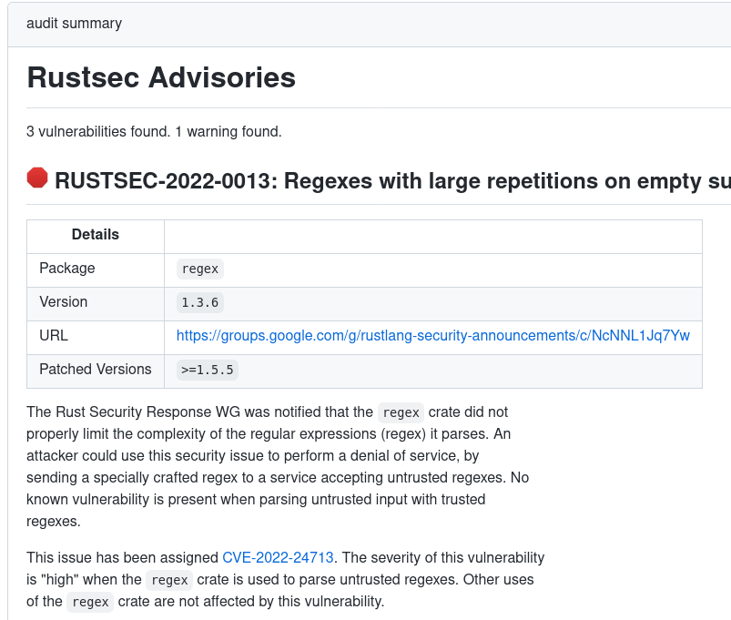

# Audit Rust dependencies using the RustSec Advisory DB

Audit your Rust dependencies using [cargo audit] and the [RustSec Advisory DB]. The action creates a summary with all vulnerabilieties. It can create issues for each of the found vulnerabilities.

Execution Summary:



## Example workflow

```yaml
name: "Audit Dependencies"
on:
  push:
    paths:
      # Run if workflow changes
      - '.github/workflows/audit.yml'
      # Run on changed dependencies
      - '**/Cargo.toml'
      - '**/Cargo.lock'
      # Run if the configuration file changes
      - '**/audit.toml'
  # Rerun periodicly to pick up new advisories
  schedule:
    - cron: '0 0 * * *'
  # Run manually
  workflow_dispatch:

permissions: read-all

jobs:
  audit:
    runs-on: ubuntu-latest
    permissions:
      issues: write
    steps:
      - uses: actions/checkout@v4
      - uses: actions-rust-lang/audit@v1
        name: Audit Rust Dependencies
        with:
          # Comma separated list of issues to ignore
          ignore: RUSTSEC-2020-0036
```

## Inputs

All inputs are optional.
Consider adding a [`audit.toml` configuration file] to your repository for further configurations.
cargo audit supports multiple warning types, such as unsound code or yanked crates.
Configuration is only possible via the `informational_warnings` parameter in the configuration file ([#318](https://github.com/rustsec/rustsec/issues/318)).
Setting `denyWarnings` to true will also enable these warnings, but each warning is upgraded to an error.

| Name           | Description                                                                                      | Default                                                                  |
| -------------- | ------------------------------------------------------------------------------------------------ | ------------------------------------------------------------------------ |
| `TOKEN`        | The GitHub access token to allow us to retrieve, create and update issues (automatically set).   | `github.token`                                                           |
| `denyWarnings` | Any warnings generated will be treated as an error and fail the action.                          | false                                                                    |
| `file`         | The path to the Cargo.lock file.                                                                 | `Cargo.lock`                                                             |
| `ignore`       | A comma separated list of Rustsec IDs to ignore.                                                 |                                                                          |
| `createIssues` | Create/Update issues for each found vulnerability. By default only on `main` or `master` branch. | `github.ref == 'refs/heads/master' \|\| github.ref == 'refs/heads/main'` |

## License

The scripts and documentation in this project are released under the [MIT License].

[MIT License]: LICENSE
[cargo audit]: https://github.com/RustSec/rustsec/tree/main/cargo-audit
[RustSec Advisory DB]: https://rustsec.org/advisories/
[`audit.toml` configuration file]: https://github.com/rustsec/rustsec/blob/main/cargo-audit/audit.toml.example
